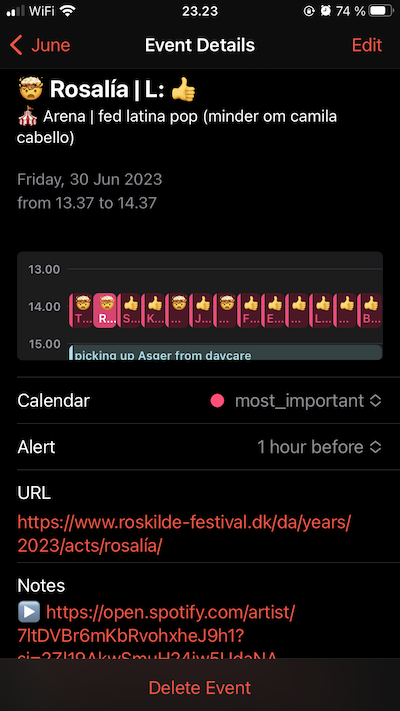

# Optimize your '23 Roskilde Festival music experience  

<center>

Find new music to love, and plan your must-see concerts|
:-:


Add fave concerts to your calendar|See relevant event details
:-:|:-:
|
...note that Roskilde hasn't published the timetable yet, so calendar functionality isn't very usable.. yet!

</center>

<details>
<summary>

## Isn't there like.. already an app for this?

</summary>

Probably! Also, the Roskilde Festival website helps a bit, but I've been desiring the following functionality: 

- Rather than just ❤️ the artists I like, I want it more granular, and be able to add comments on *why* I (dis)liked an artist
- My GF and I would like to easily see what concerts we want to see together
- Being able to listen to artists' mustic on Spotify without too many clicks
- See the relevant information at the right time in a familiar interface

</details>

## Get started

1. Make a copy of [this google sheet](https://docs.google.com/spreadsheets/d/1uu3_S_e2zR5O2cTbknIUh4bG1GymBtdwieFwZynTPRY/edit#gid=555358856), and clear values in column `H`, `I`, and `M`
2. Listen to all the amazing (and not-so-amazing 💩) music
3. Edit the `SHEET_ID` parameter in `transform.ipynb` to source your spreadsheet, and run the code
    - If u changed column names in step 1, remember to update the code accordingly 
4. Load the calendar-file into your prefered calendar

<details>
<summary>

## Under the hood

</summary>


1. `is_everything_synced.ipynb` compares roskilde-website, `output.csv`, and the google sheet containing your own ratings, and makes it easy to add new artists to the google sheet with some crazy cmd+c cmd+v action
2. `roskilde.ipynb` scrapes selected programme information from the roskilde website
3. scraped data is written to `output.csv`
4. `transform.ipynb` outputs ratings + fave artists to an .ics calendar file

### installation

```shell
git clone https://github.com/djmikeale/RF23.git
cd RF23
python3 -m venv venv
source venv/bin/activate
python3 -m pip install --upgrade pip
python3 -m pip install -r requirements.txt
source venv/bin/activate
```

- for scraping, ensure you have set up a [selenium webdriver](https://www.selenium.dev/documentation/webdriver/getting_started/)

</details>
